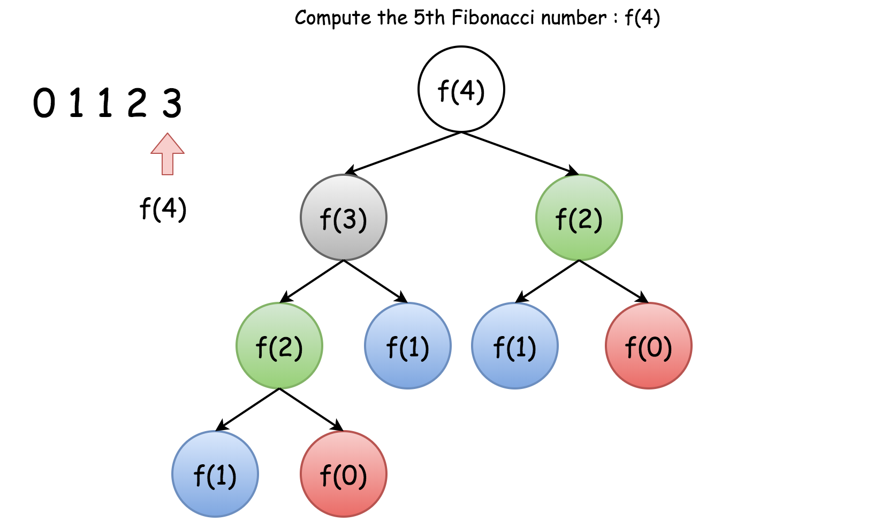
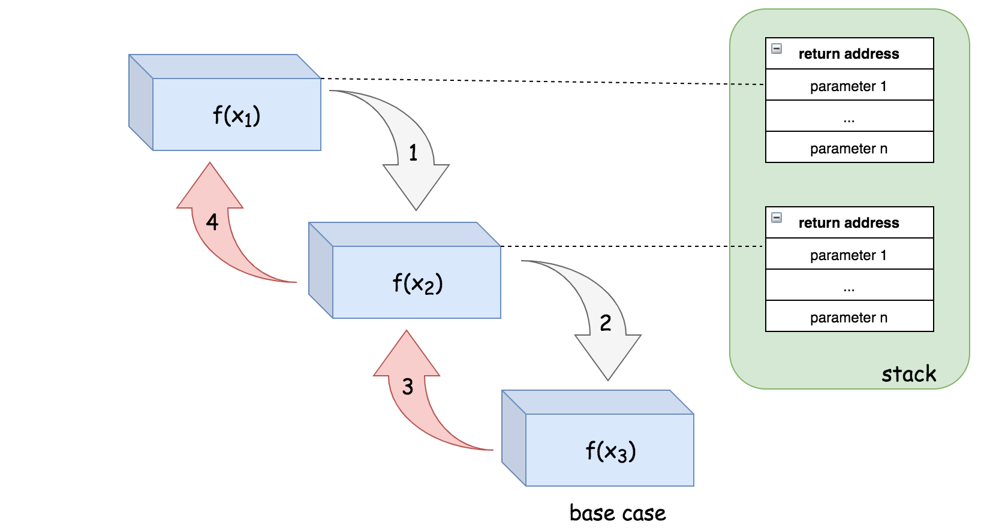

## 递归


#### 定义：**递归算法是一种直接或者间接调用自身函数或者方法的算法。**

通俗来说，递归算法的实质是把问题分解成规模缩小的同类问题的子问题，然后递归调用方法来表示问题的解。它有如下特点：

- 1. 一个问题的解可以分解为几个子问题的解
- 2. 这个问题与分解之后的子问题，除了数据规模不同，求解思路完全一样
- 3. 存在递归终止条件，即必须有一个明确的递归结束条件，称之为递归出口

#### 经典案例：

1.数组求和：Sum(arr[0...n-1]) = arr[0] + Sum(arr[1...n-1])

2.汉诺塔问题：

3.爬台阶问题/斐波那契数列：

------


#### 递归原理：

你可能想知道如何实现调用自身的函数。诀窍在于，每当递归函数调用自身时，它都会将给定的问题拆解为子问题。递归调用继续进行，直到到子问题无需进一步递归就可以解决的地步。

为了确保递归函数不会导致无限循环，它应具有以下属性：

1. 一个简单的基本案例（basic case）（或一些案例） —— 能够不使用递归来产生答案的终止方案。
2. 一组规则，也称作递推关系（recurrence relation），可将所有其他情况拆分到基本案例。

注意，函数可能会有多个位置进行自我调用。

**示例：以相反的顺序打印字符串：**

你可以使用迭代的办法轻而易举地解决这个问题，即从字符串的最后一个字符开始遍历字符串。但是如何递归地解决它呢？

首先，我们可以将所需的函数定义为 printReverse(str[0...n-1])，其中 str[n - 1] 表示字符串中的最后一个字符。然后我们可以分两步完成给定的任务：

1. printReverse(str[0...n-2])：以相反的顺序打印子字符串 str[0...n-2]。
2. print(str[n - 1])：打印字符串中的最后一个字符。

注意，我们在第一步中调用函数本身，根据定义，它使函数递归

------


#### 递推关系：

在实现递归函数之前，有两件重要的事情需要弄清楚:

- **递推关系**：一个问题的结果与其子问题的结果之间的关系。
- **基本情况**： 不需要进一步的递归调用就可以直接计算答案的情况。有时，基本案例也被称为 bottom cases，因为它们往往是问题被减少到最小规模的情况，也就是如果我们认为将问题划分为子问题是一种自上而下的方式的最下层。

一旦计算出这两个元素，再想要实现递归函数，就只需要根据**递推关系**调用函数本身，直到其抵达**基本情况**。

**示例：**（帕斯卡三角（Pascal's Triangle），又名杨辉三角）

帕斯卡三角形是排列成三角形的一系列数字。 在帕斯卡三角形中，每一行的最左边和最右边的数字总是 1。 对于其余的每个数字都是前一行中直接位于它上面的两个数字之和。

下面的插图给出了一个 5 行的帕斯卡三角：


**递推关系**：

首先，我们定义一个函数 f(i, j)，它将会返回帕斯卡三角形第 i 行、第 j 列的数字。

我们可以用下面的公式来表示这一递推关系：

f(i, j) = f(i - 1, j - 1) + f(i - 1, j)

**基本情况：**

可以看到，每行的最左边和最右边的数字是基本情况

因此，我们可以将基本情况定义如下：f(i, j) = 1 where j=1 or j=i

**演示：**

一旦我们定义了递推关系、基本情况。递归函数的实现变得更加直观，特别是在我们用数学公式表示出这两个元素之后。下面给出一例子，展示我们如何用这个公式递归地计算 f(5, 3), 也就是 帕斯卡三角形第 5 行中的第 3 个数。

我们可以将 f(5, 3) 分解为 f(5, 3) = f(4, 2) + f(4, 3)，然后递归地调用 f(4, 2)和 f(4, 3)：

- 对于调用的 f(4, 2)，我们可以进一步展开它，直到到达基本情况，正如下面所描述的：

  f(4, 2) = f(3, 1) + f(3, 2) = f(3, 1) + (f(2, 1) + f(2, 2)) = 1 + (1 + 1) = 3

- 对于调用的 f(4, 3)，类似地，我们可以将其分解为：

  f(4, 3) = f(3, 2) + f(3, 3) = (f(2, 1) + f(2, 2)) + f(3, 3) = (1 + 1) + 1 = 3

- 最后，我们结合上述子问题的结果：f(5, 3) = f(4, 2) + f(4, 3) = 3 + 3 = 6

在上面的例子中，可以看到递归解决方案可能会导致一些重复的计算，例如，我们重复计算相同的中间数以获得最后一行中的数字。 举例说明，为了得到 f(5, 3) 的结果，我们在 f(4, 2)和 f(4, 3)的调用中计算了 f(3,2) 两次。

------


#### 递归中的重复计算：

通常情况下，递归是一种直观而有效的实现算法的方法。 但是，如果我们不明智地使用它，可能会给性能带来一些不希望的损失，例如重复计算。这里提出一种常用的技术，称为**记忆化（memoization）**，可以用来避免这个问题。

为了演示重复计算的另一个问题，看一个大多数人可能都很熟悉的例子，[斐波那契数](https://baike.baidu.com/item/斐波那契数)。 如果我们定义函数 F(n) 表示在索引 n 处的斐波那契数，那么可以推导出如下：

递推关系：F(n) = F(n - 1) + F(n - 2)，

基本情况：F(0) = 0, F(1) = 1

代码实现：

```go
func Fib_recursion(n int) int{
	if n <= 2{
		return 1    // 前两个
	}else{
		return Fib_recursion(n - 1) + Fib_recursion(n - 2)
	}
}
```

现在，如果你想知道 F(4)是多少，你可以应用上面的公式并进行展开：F(4) = F(3) + F(2) = (F(2) + F(1)) + F(2)

正如你所看到的，为了得到 F(4) 的结果，我们需要在上述推导之后计算两次数F(2) : 第一次在 F(4) 的第一次展开中，第二次在中间结果 F(3) 中。

下面的树显示了在计算 F(4) 时发生的所有重复计算（按颜色分组）



**记忆化（memoization）**

为了消除上述情况中的重复计算，正如许多人已经指出的那样，其中一个想法是将中间结果**存储**在缓存中，以便我们以后可以重用它们，而不需要重新计算。这个想法也被称为**记忆化**，这是一种经常与递归一起使用的技术。

[记忆化](https://baike.so.com/doc/4953402-5174974.html) 是一种优化技术，主要用于**加快**计算机程序的速度，方法是**存储**昂贵的函数调用的结果，并在相同的输入再次出现时返回缓存的结果。 (来源: 维基百科)

回到斐波那契函数 F(n) 。 我们可以使用哈希表来跟踪每个以 n 为键的 F(n) 的结果。散列表作为一个缓存，可以避免重复计算。 记忆化技术是一个很好的例子，它演示了如何通过增加额外的空间以减少计算时间。

为了便于比较，我们在下面提供了带有记忆化功能的斐波那契数列解决方案的实现。

作为一种练习，您可以尝试使记忆化更加通用和非侵入性，即应用记忆化技术而不改变原来的功能。(提示: 可以参考一种被称作 **decorator** 的设计模式)。

代码实现：

```go
var cache = make(map[int]int)

func Fib_recursion_2(n int) int{
	result, ok := cache[n]
	if ok {
		return result
	}

	if n <= 2{
		result = 1    // 前两个
	}else{
		result =  Fib_recursion_2(n - 1) + Fib_recursion_2(n - 2)
	}
	cache[n] = result
	return result
}
```

另一个经典的问题是[爬楼梯](https://leetcode-cn.com/explore/orignial/card/recursion-i/258/memoization/1213/)，参考 Arithmetic/Recursion/ClimbStairs.go

------


#### 递归的时间复杂度

给出一个递归算法，其时间复杂度 O(T) 通常是**递归调用的数量**（记作R） 和计算的时间复杂度的乘积（表示为 O(s)）的乘积：O(T)  = R * O(s)

**示例**：

在[反转字符串](https://leetcode-cn.com/explore/orignial/card/recursion-i/256/principle-of-recursion/1198/)问题中，我们需要以相反的顺序打印字符串，解决问题的递归关系可以表示如下：

printReverse(str) = printReverse(str[1...n]) + print(str[0])

其中 str[1...n] 是输入字符串 str 的子串，仅不含前导字符 str[0]

该函数将被递归调用 n 次，其中 n 是输入字符串的大小。在每次递归结束时，我们只是打印前导字符，因此该特定操作的时间复杂度是恒定的，即 O(1)。

总而言之，我们的递归函数 printReverse(str) 的总体时间复杂度为 ：O(printReverse)= n ∗ O(1)=O(*n*)。

**执行数：**

对于递归函数，递归调用的数量很少与输入的大小呈线性关系。在[斐波那契数](https://leetcode-cn.com/explore/orignial/card/recursion-i/258/memoization/1212/)问题中，其递推关系被定义为 f(n) = f(n-1) + f(n-2)。乍一看，在执行斐波那契函数期间计算递归调用的数量似乎并不简单。

在这种情况下，最好采用**执行树**，这是一个用于表示递归函数的执行流程的树。树中的每个节点都表示递归函数的调用。因此，树中的节点总数对应于执行期间的递归调用的数量。

递归函数的执行树将形成 n 叉树，其中 n 作为递推关系中出现递归的次数。例如，斐波那契函数的执行将形成二叉树，例如斐波纳契数 f(4) 的执行树（在上面）。

在 n 层的完全二叉树中，节点的总数为 2^n -1。因此 f(n) 中递归数目的上限（尽管不严格）也是 2^n -1。那么我们可以估计 f(n) 的时间复杂度为 O(2^n)

**记忆化：**

在前面讨论了通常用于优化递归算法的时间复杂度的记忆化技术。过高速缓存和重用中间结果，记忆化技术可以大大减少递归调用的数量，即减少执行树中的分支数量。在使用记忆化分析递归算法的时间复杂度时，也应该考虑到这种减少。

斐波纳契数的例子通过记忆化技术，我们保存每个索引 n 对应的的斐波那契数的结果。我们确信每个斐波那契数的计算只会发生一次。而从递推关系来看，斐波纳契数 f(n) 将取决于其所有 n-1个先验斐波纳契数。结果，计算 f(n) 的递归将被调用 n-1 次以计算它所依赖的所有先验数字。

现在，我们可以简单地应用我们在本章开头介绍的公式来计算时间复杂度，即 O(1) * n = O(n)。记忆化技术不仅可以优化算法的时间复杂度，还可以简化时间复杂度的计算。

------


#### 递归的空间复杂度

在计算递归算法的空间复杂度时，应该考虑造成空间消耗的两个部分：递归相关空间（recursion related space）和非递归相关空间（non-recursion related space）

**递归相关空间：**

是指由递归直接引起的内存开销，即用于跟踪递归函数调用的堆栈。为了完成典型的函数调用，系统应该在栈中分配一些空间来保存三个重要信息：

1. 函数调用的返回地址。一旦函数调用完成，程序应该知道返回的位置，即函数调用之前的点；
2. 传递给函数调用的参数； 
3. 函数调用中的局部变量。.

栈中的这个空间是函数调用期间产生的最小成本。然而，一旦完成函数调用，就会释放该空间。

对于递归算法，函数调用将连续链接直到它们到达基本情况（也称为底层情况）。这意味着用于每个函数调用的空间也会累积。

对于递归算法，如果没有产生其他内存消耗，则此递归引起的空间将是算法的空间上限。

**示例：**

在练习[反转字符串](https://leetcode-cn.com/explore/orignial/card/recursion-i/256/principle-of-recursion/1198/)中，我们没有使用额外的内存，因为我们仅仅是打印一个字符。对于每个递归调用，我们假设它可能需要一个最大为某一常量值的空间。并且递归调用最多可以链接 n 次，其中 n 是输入字符串的大小。因此，该递归算法的空间复杂度就是 O(n)。

为了更好地说明这一点，接下来我们将会展示递归调用f(x1) -> f(x2) -> f(x3) 的执行顺序以及栈空间的分配情况。



栈中的空间将会分配给 f(x1) 来调用 f(x2) 。类似的情况也同样发生在 f(x2) 中，系统会为 f(x3) 的调用分配另一个空间，最后在f(x3)中，我们到达基本情况，因此在 f(x3)中没有进行进一步的递归调用。

正是由于这些与递归相关的空间消耗，有时可能会遇到称为[堆栈溢出](https://baike.baidu.com/item/堆栈溢出/1231765?fr=aladdin)的情况，其中为程序分配的堆栈达到其最大空间限制并导致程序最终失败。在设计递归算法时，应该仔细评估在输入规模扩大时是否存在堆栈溢出的可能性。

**非递归相关空间：**

正如名称所示，非递归相关空间指的是与递归过程没有直接关系的内存空间，通常包括为全局变量分配的空间（通常在堆中）。

**总结：**

不管是否递归，你都可能需要在任何函数调用之前将问题的输入存储为全局变量。你可能还需要保存递归调用的中间结果。后者就是我们前面提到过的**记忆化技术**。例如，在使用带有记忆化技术的递归算法解决斐波那契数问题时,我们使用映射（map）来跟踪在递归调用期间产生的所有中间斐波那契数。因此，在分析空间复杂度时，我们应该考虑到因采用记忆化技术所导致的空间成本。

------


#### 尾递归

[尾递归](https://baike.baidu.com/item/尾递归/554682)是特殊递归情况，它不受此空间开销的影响

尾递归函数是递归函数的一种，其中递归调用是递归函数中的最后一条指令并且在函数中应该只有一次递归调用。

可以在Arithmetic/Recursion/arraySum.go中看到了尾递归与非尾递归的例子。非尾递归示例中，在最后一次递归调用之后有一个额外的计算。

尾递归的好处是可避免递归调用期间栈空间开销的累积，因为系统可以为每个递归调用重用栈中的固定空间。

例如，对于递归调用序列` f(x1) -> f(x2) -> f(x3)`，如果函数 `f(x)` 以尾递归的形式实现。那么其执行步骤的顺序和栈空间的分配如下所示：


请注意，在尾递归的情况下，一旦从递归调用返回，我们也会立即返回，因此我们可以跳过整个递归调用返回链，直接返回到原始调用方。这意味着我们根本不需要所有递归调用的调用栈，这为我们节省了空间。

例如，在步骤（1）中，栈中的一个空间将被分配给 f(x1），以便调用 f(x2)。然后，在步骤（2）中，函数 f(x2) 能够递归地调用 f(x3)，但是，系统不需要在栈上分配新的空间，而是可以简单地重用先前分配给第二次递归调用的空间。最后，在函数 f(x3) 中，我们达到了基本情况，该函数可以简单地将结果返回给原始调用方，而不会返回到之前的函数调用中。

尾递归函数可以作为非尾递归函数来执行，也就是说，带有调用栈并不会对结果造成影响。通常，编译器会识别尾递归模式，并优化其执行。然而，并不是所有的编程语言都支持这种优化，比如 C，C++ 支持尾递归函数的优化。另一方面，Java 和 Python 不支持尾递归优化。